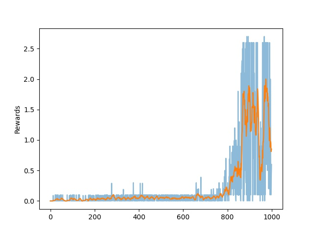

# P3-collab-compet
This project presents the Reinforcement Learning algorithm to solve the P3-collab-compet project of the Udacity - 
Deep Reinforcement Learning course.

## Getting started
- Install Unity [python packages](https://github.com/Unity-Technologies/ml-agents/blob/main/docs/Installation.md)
- Set up the DRLND environment [here](https://github.com/udacity/deep-reinforcement-learning#dependencies)
- Download the Tennis environment (LINUX) from [here](https://s3-us-west-1.amazonaws.com/udacity-drlnd/P3/Tennis/Tennis_Linux.zip)

### Set up
Unzip the file into the same folder of the DRL_ContinuousControl project
 
	unzip /PATH/TO/TENNIS_ENV.zip /PATH/TO/DRL_collab_compet

Activate conda environment:
    
    conda activate drlnd

### Usage
The script _main.py_ can be executed with two options:

    Usage:
        --no_training : run a single episode
        --training N : with N number of episodes, if no number is provided, it trains the algorithm for 1k episodes

## The environment

The project environment comprises two tennis rackets that pass each other a ball over a net.

Each agent can perform 2 continuous actions at every step. One action is the x-axis movement, and one action is the y-axis movement,
the admissible values are clipped between -1 and 1.

The environment provides a positive reward of +0.1, when the agent send the ball in the opponent field and a reward of -0.01 
if the agent lets the ball fall on the ground. The goal of the game is to play for as long as possible.
 
## The method
The presented solution employs the _Multi Agent Deep Deterministic Policy Gradient_ (_MADDPG_) method. 

**About DDPG**

This method is a model-free off-policy learning algorithm suitable for continuous actions. It belongs to the groups of actor-critic methods, which extends policy gradient and q-values methods. Two independent networks are used for the actor and the critic. The former provides the best action given the state, and the latter provides the q-value for a pair (state, action). 
These two networks are used in combination to learn the best policy by proposing a policy (actor) and criticising the results using the q-values (critic).

Because the critic uses a DQN, the algorithm can be seen as an extension of DQN to continuous action space. Similarly to DQN, DDPG approximate the Q-table, and mitigation techniques must be considered to avoid instabilities. DDPG uses a replay-buffer and a target network. The former stores experience coming from past episodes in the shape of tuples (state, action, reward, next_state, done), the latter mitigates the problem of learning by using a moving target, and represents a copy of the network updated with a certain delay.

Both actor and critic use two networks: a target and a local.

A common method to balance exploitation and exploration is using epsilon-greedy policies. This method uses the current best policy with probability (1 - epsilon) and explores a uniformly random generated action with probability (epsilon). 
However, DDPG commonly substitute this method with a soft-update (polyak method) of the target policy, and a noise to the predicted actions. 

DDPG does not learn at every step. To avoid overfitting, the method learns only a certain number of steps, so that new experience is available in the replay buffer. Moreover, the learning phase is repeated several times once the learning is activated.

**About MADDPG**

MADDPG is the multi agent extension of the DDPG algorithm. It uses a framework with centralised training and decentralised execution.

The three main assumptions of this algorithms are:
    • the learned policies can only use local information (i.e. their own observations) at execution time
    • we do not assume a differentiable model of the environment dynamics
    • We do not assume any particular structure on the communication method between agents

Each agent learns from the partial observation of the state given by its surroundings, and no communication is permitted between the compeating agents. The observed state is fed into a DDPG agent that learns the best action. We use two DDPG agents, one each agent.

Important insights throughout the implementation

Throughout the implementation a few important elements have emerged:

- The **noise**: Similarly to the p2 project, we initially implemented the Ornstein–Uhlenbeck process to generate noise. However, the learning was very unstable, and we turned back to the Gaussian noise at zero mean (as suggested byOpenAI). Thanks to this type of noise, the algorithm increased in robustness and stability.

- The **learn every N step** and the **learning per step**: Initially, we set (50, 40) respectively, but the networks couldn’t get hold of a good policy to solve the environent. Therefore, we run a small campain to select the best values, and we landed on very distant configuration from the one initially adopted.
The winning pair was (1, 5). In this configuration, the algorithm learns 5 times from the same experience at each step.  Although generally it may result in overfitting, the soft update of the target network mitigates the issue and reliable results are achieved.

- The **polyak** coefficient: commonly, we want to this number to be around 0.99, which means a slow conversion of the new learnings (local network) to the solid learnings (target network). However, this environment requested a faster learning rates to avoid convergence in the order of 10k iterations (when happened). 

## RL Hyperparameters
Max number of episodes: 1000

Max time per episode: 5000

Gamma: 0.99

learn every N step: 1

learning per step: 5

Replay Buffer: 1e6

Batch size: 128

Soft update value: 0.85

## NN Hyperparameters

### Actor 

Network structure: One Regularisation layer, two linear layers with Leaky ReLu activation, and a hyperbolic tangent as output layer

First Hidden Layer = 400 nodes

Second Hidden Layer = 300 nodes

### Critic 
Network structure: One Regularisation layer, two linear layers with Leaky ReLu activation, and a linear layer.
This network takes in the state and the action, but the action are fed inside the network only after the first linear layer

First Hidden Layer = 400 nodes

Second Hidden Layer =  300 nodes

## The result

We consider the algorithm finished when an average value of +0.5 is reached over 100 iterations. Because two rewards are obtained, we take the maximum reward between the two agents.

The learning graph below shows that we reach the target after 823 iterations, the network touches the ceiling of 2.56 after roughly 900 iterations, and the max result over 100 iterations is 2.0.

The blue line represents the score results for 1000 episodes, ana the red line represents a moving average of the scores with a window of 100 samples.

## Future work
This environment provides sparse rewards that make a few of the experience way more important than others. For this reason, the implementation of the prioritised experience could be very beneficial.
    • We can use the rank-based method that provides higher probability of being replaied to the experiences yielding higher learning rate (TD-Error).